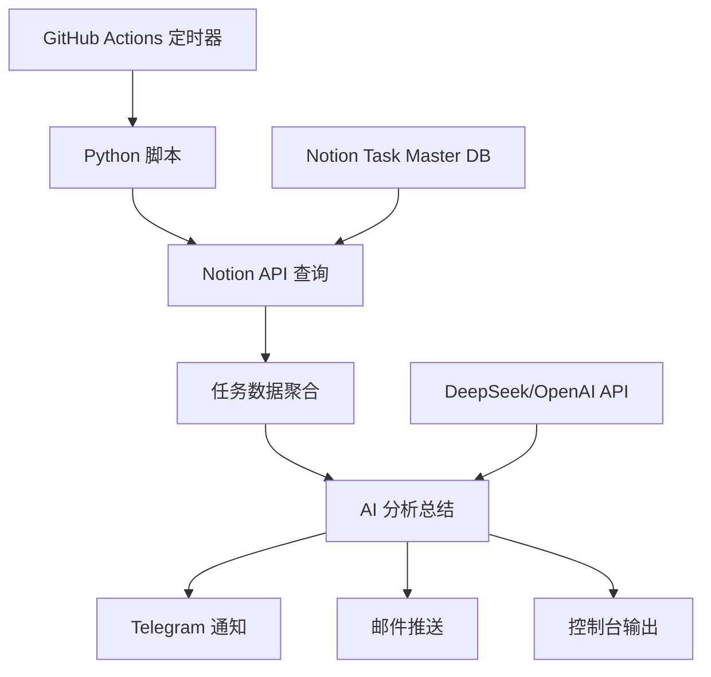

# 🤖 Task Master AI - 智能任务总结系统

> 基于 Notion + GitHub Actions + AI 的自动化个人效率复盘工具

[](https://github.com/yourusername/task-master-ai/actions/workflows/daily.yml)
[](https://github.com/yourusername/task-master-ai/actions/workflows/weekly.yml)
[](https://github.com/yourusername/task-master-ai/actions/workflows/monthly.yml)

## ✨ 核心特性

- **🔄 全自动运行** - GitHub Actions 定时触发，无需人工干预
- **📊 智能分析** - AI 驱动的任务完成度分析和改进建议
- **📱 多渠道推送** - 支持 Telegram、邮件等多种通知方式
- **🎯 多周期复盘** - 日报、周报、月报三级复盘体系
- **🛠️ 高度可定制** - 灵活的模板系统和配置选项
- **🚀 开箱即用** - 最小化配置，快速部署

## 🏗️ 系统架构



## 📋 前置要求

### Notion 设置
1. 创建 Notion 集成并获取 Token
2. 设置 Task Master 数据库，包含以下字段：
   - **任务名称** (Title)
   - **分类** (Select): Work/Study/Health/Life 等
   - **优先级** (Select): MIT/次要/随缘
   - **状态** (Select): Todo/Doing/Done/Snoozed
   - **计划日期** (Date with time)
   - **估时(min)** (Number)

### API 密钥
- Notion Integration Token
- DeepSeek API Key 或 OpenAI API Key
- （可选）Telegram Bot Token
- （可选）邮箱 SMTP 配置

## 🚀 快速开始

### 1. Fork 并克隆仓库

```bash
git clone https://github.com/yourusername/task-master-ai.git
cd task-master-ai
```

### 2. 设置 GitHub Secrets

在仓库的 `Settings → Secrets and variables → Actions` 中添加：

| Secret 名称 | 必需 | 说明 |
|------------|------|------|
| `NOTION_TOKEN` | ✅ | Notion 集成令牌 |
| `NOTION_DB_ID` | ✅ | Task Master 数据库 ID |
| `DEEPSEEK_KEY` | ✅ | DeepSeek API 密钥 |
| `TELEGRAM_BOT_TOKEN` | ❌ | Telegram 机器人令牌 |
| `TELEGRAM_CHAT_ID` | ❌ | Telegram 聊天 ID |
| `EMAIL_SMTP_SERVER` | ❌ | 邮件 SMTP 服务器 |
| `EMAIL_USERNAME` | ❌ | 邮件用户名 |
| `EMAIL_PASSWORD` | ❌ | 邮件密码/应用密码 |

### 3. 手动测试运行

在 GitHub Actions 页面，选择对应的 workflow 并点击 "Run workflow" 进行测试。

### 4. 自动化运行时间

- **日报**: 每天 23:30 UTC (北京时间 07:30)
- **周报**: 每周一 00:00 UTC (北京时间 08:00)  
- **月报**: 每月1号 01:00 UTC (北京时间 09:00)

## 🎯 使用示例

### 日报输出示例

```markdown
# Daily Review
已完成任务 8 个，分类分布：Work:5, Health:2, Study:1，获得 XP 65，其中 MIT 任务 3 个。

## 任务清单
- 完成产品需求文档
- 参加团队会议
- 健身房锻炼
- 阅读技术文章
- ...

**今日亮点**
1. 高效完成3个MIT任务，工作专注度显著提升
2. 坚持健身计划，运动习惯逐步养成
3. 学习新技术栈，知识储备持续扩充

**改进空间**
会议时间管理需要优化，部分讨论偏离主题导致效率下降

**明日行动**  
1. 优先处理客户反馈，确保产品迭代进度
2. 制定会议议程模板，提升沟通效率
3. 安排深度工作时间块，减少打断干扰
```

## ⚙️ 高级配置

### 自定义提示词模板

在 `templates/` 目录下修改对应的提示词文件：
- `daily_prompt.txt` - 日报模板
- `weekly_prompt.txt` - 周报模板  
- `monthly_prompt.txt` - 月报模板

### 本地开发运行

```bash
# 安装依赖
pip install -r requirements.txt

# 复制环境变量模板
cp .env.example .env

# 编辑 .env 文件，填入你的配置
vim .env

# 运行测试
python -m src.main --period daily --dry-run --verbose
```

### 运行测试套件

```bash
pip install pytest pytest-mock
pytest tests/ -v
```

## 📊 数据流程

1. **数据采集**: 从 Notion 数据库查询指定时间段的已完成任务
2. **数据处理**: 统计任务数量、分类分布、XP 值、MIT 完成情况
3. **AI 分析**: 将结构化数据发送给 LLM，生成个性化总结和建议
4. **结果推送**: 通过多种渠道将分析结果推送给用户

## 🔧 故障排查

### 常见问题

**Q: GitHub Actions 显示 "Notion API 调用失败"**
- 检查 NOTION_TOKEN 是否正确设置
- 确认集成权限已正确配置
- 验证数据库 ID 格式正确

**Q: 没有收到通知推送**  
- 检查对应的 Secret 配置是否完整
- 查看 Actions 日志中的错误信息
- 使用 `--dry-run` 模式测试

**Q: AI 总结质量不佳**
- 调整 `templates/` 中的提示词模板
- 考虑切换到 OpenAI GPT-4 模型
- 检查任务数据的完整性

### 日志查看

在 GitHub Actions 的运行日志中可以看到详细的执行信息：
- 任务查询结果
- AI 调用状态  
- 通知发送结果

## 🤝 贡献指南

欢迎提交 Issue 和 Pull Request！

1. Fork 本仓库
2. 创建特性分支 (`git checkout -b feature/amazing-feature`)
3. 提交更改 (`git commit -m 'Add amazing feature'`)
4. 推送到分支 (`git push origin feature/amazing-feature`)
5. 创建 Pull Request

## 📄 许可证

本项目采用 MIT 许可证 - 详见 [LICENSE](LICENSE) 文件

## 🙏 致谢

- [Notion API](https://developers.notion.com/) - 强大的数据管理平台
- [DeepSeek](https://www.deepseek.com/) - 高质量的 AI 模型服务
- [GitHub Actions](https://github.com/features/actions) - 可靠的 CI/CD 平台

## 📞 支持

如果这个项目对你有帮助，请给个 ⭐ Star！

有问题或建议？欢迎 [提交 Issue](https://github.com/yourusername/task-master-ai/issues/new)。